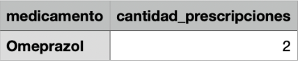
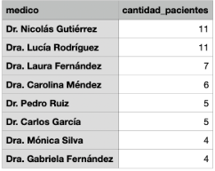

# Trabajo Práctico N.º 4 — Informática Médica (ITBA)


**Tema:** BBDD, SQL y Manejo de Versiones  
**Integrantes:** Imanol González — Marika Rizzo  
**Año:** 2025  

---

## 1. Base de Datos

### 1.1 ¿Qué tipo de base de datos es? Clasificarla según estructura y función.

La base de datos, según su estructura, es de tipo **relacional** porque los datos se organizan en tablas con relaciones definidas entre ellas.  
Según su función, es de tipo **transaccional** porque permite realizar operaciones de modificación, inserción y eliminación de datos de forma continua y segura.

---

### 1.2 Planteando el Modelo conceptual, armar el diagrama entidad-relación de la base de datos dada. 

**Modelo conceptual (Notación de Chen)**

- La especialidad de los médicos se modela como entidad independiente para eliminar la redundancia e inconsistencia, porque la misma especialidad puede estar asociada a más médicos.


---

### 1.3 Mapear el Modelo conceptual planteado en el punto 2 al Modelo Relacional de la base de datos.

**Modelo relacional (Notación Crow’s Foot)**

Mapeo del modelo conceptual planteado al modelo relacional de la base de datos.  

> “Supongamos que todo médico debe tener una especialidad para poder realizar una consulta.”
 


---

### 1.4 Normalización

**→Primera forma normal (1FN):**  
La base de datos cumple la primera forma normal, porque en las tablas no existen grupos repetidos ni atributos multivaluadoso sea, no hay arreglos ni listas dentro de las celdas.
Cada campo contiene un solo valor atómico.

**→Segunda forma normal (2FN):**  
La base de datos no cumple completamente la segunda forma normal, porque en varias tablas aparecen tanto el identificador (ID) como el nombre descriptivo de una entidad, (ej: ID médico, nome médico).
Para cumplir la 2FN, sería necesario eliminar los atributos redundantes.

**→Tercera forma normal (3FN):**  
La tercera forma normal no se cumple todavía, ya que depende de que la base cumpla la 2FN, ya que la 1FN se cumplió.
Sin embargo, una vez eliminadas las dependencias parciales, la 3FN podría cumplirse, porque en este modelo no existen dependencias transitivas, o sea, ningún atributo depende de otro atributo que no sea clave.

---

## 2. SQL

> Cada query se presenta en formato de código y debajo una imagen con el resultado obtenido.

---

### **1.** Índice por ciudad (optimización de consultas con GROUP BY)
#### Cuando se realizan consultas sobre la tabla paciente agrupando por ciudad los tiempos de respuesta son demasiado largos. Proponer mediante una query SQL una solución a este problema.
Para mejorar el rendimiento de las consultas que agrupan por ciudad, se puede crear un índice sobre la columna ciudad:
```sql
CREATE INDEX idx_pacientes_ciudad ON Pacientes(ciudad);
```
Esto reduce los tiempos de respuesta al evitar el escaneo completo y el reordenamiento de la tabla en cada consulta GROUP BY.


### **2.** Cálculo dinámico de la edad de los pacientes
#### Se tiene la fecha de nacimiento de los pacientes. Se desea calcular la edad de los pacientes y almacenarla de forma dinámica en el sistema ya que es un valor típicamente consultado, junto con otra información relevante del paciente.
```sql
SELECT id_paciente, nombre, fecha_nacimiento, EXTRACT(YEAR FROM AGE(CURRENT_DATE, fecha_nacimiento)) AS edad FROM Pacientes;
```


### **3.** Actualización de la dirección de la paciente “Luciana Gómez”
#### La paciente, “Luciana Gómez”, ha cambiado de dirección. Antes vivía en “Avenida Las Heras 121” en “Buenos Aires”, pero ahora vive en “Calle Corrientes 500” en “Buenos Aires”. Actualizar la dirección de este paciente en la base de datos.
```sql
UPDATE pacientes SET calle = 'Calle Corrientes', numero = '500' WHERE nombre = 'Luciana Gómez';
```
Si también la ciudad fue diferente:
```sql
UPDATE pacientes SET calle = 'Calle Corrientes', numero = '500', ciudad = ‘Buenos Aires’ WHERE nombre = 'Luciana Gómez';
```


### **4.** Médicos cuya especialidad tiene ID = 4
#### Seleccionar el nombre y la matrícula de cada médico cuya especialidad sea identificada por el id 4.
```sql
SELECT nombre, matricula from medicos where especialidad_id = 4;
```


### **5.** Corrección de inconsistencias en los nombres de ciudades
#### Puede pasar que haya inconsistencias en la forma en la que están escritos los nombres de las ciudades, ¿cómo se corrige esto? Agregar la query correspondiente.
Se aplica esto por cada ciudad:
```sql
UPDATE pacientes SET ciudad='Buenos Aires' where  TRIM(LOWER(ciudad)) ILIKE '%buenos%' OR TRIM(LOWER(ciudad)) ILIKE '%aire%';
```


### **6.** Nombre y dirección de pacientes que viven en Buenos Aires
#### Obtener el nombre y la dirección de los pacientes que viven en Buenos Aires.
```sql
SELECT nombre, calle, numero from pacientes where ciudad = 'Buenos Aires';
```


### **7.** Cantidad de pacientes que viven en cada ciudad
#### Cantidad de pacientes que viven en cada ciudad.
Por esta forma, todas las inconsistencias en los nombres de las ciudades fueron corregidas.
```sql
SELECT ciudad, COUNT(*) AS cantidad_pacientes FROM pacientes GROUP BY ciudad ORDER BY cantidad_pacientes DESC;
```


### **8.** Cantidad de pacientes por sexo y ciudad
#### Cantidad de pacientes por sexo que viven en cada ciudad.
```sql
SELECT ciudad, sexobiologico.descripcion AS sexo, COUNT(*) AS cantidad_pacientes FROM pacientes JOIN sexobiologico ON pacientes.id_sexo = sexobiologico.id_sexo GROUP BY ciudad, sexobiologico.descripcion ORDER BY ciudad, sexo;
```


### **9.** Cantidad de recetas emitidas por cada médico
#### Obtener la cantidad de recetas emitidas por cada médico.
```sql
SELECT medicos.nombre AS medico, COUNT(recetas.id_receta) AS cantidad_recetas FROM medicos LEFT JOIN recetas ON medicos.id_medico = recetas.id_medico GROUP BY medicos.nombre ORDER BY cantidad_recetas DESC;
```


### **10.** Consultas médicas realizadas por el médico con ID = 3 durante agosto de 2024
#### Obtener todas las consultas médicas realizadas por el médico con ID igual a 3 durante el mes de agosto de 2024.
```sql
SELECT * FROM Consultas WHERE id_medico = 3 AND fecha BETWEEN '2024-08-01' AND '2024-08-31';
```


### **11.** Nombre de los pacientes con fecha y diagnóstico de consultas en agosto 2024
#### Obtener el nombre de los pacientes junto con la fecha y el diagnóstico de todas las consultas médicas realizadas en agosto del 2024.
```sql
SELECT pacientes.nombre AS pacientes, fecha AS fecha_consulta, diagnostico FROM consultas JOIN pacientes ON pacientes.id_paciente = consultas.id_paciente WHERE fecha BETWEEN '2024-08-01' AND '2024-08-31';
```


### **12.** Medicamentos prescritos más de una vez por el médico con ID = 2
#### Obtener el nombre de los medicamentos prescritos más de una vez por el médico con ID igual a 2.
```sql
SELECT medicamentos.nombre AS medicamento,
COUNT(recetas.id_receta) AS cantidad_prescripciones
FROM recetas
JOIN medicamentos ON recetas.id_medicamento = medicamentos.id_medicamento
WHERE recetas.id_medico = 2
GROUP BY medicamentos.nombre
HAVING COUNT(recetas.id_receta) > 1
ORDER BY cantidad_prescripciones DESC;
```


### **13.** Cantidad total de recetas por paciente
#### Obtener el nombre de los pacientes junto con la cantidad total de recetas que han recibido.
```sql
SELECT pacientes.nombre AS pacientes, COUNT(id_receta) AS cantidad_recetas
FROM recetas
LEFT JOIN pacientes ON pacientes.id_paciente = recetas.id_paciente
GROUP BY pacientes.nombre
ORDER BY cantidad_recetas DESC;
```


### **14.** Medicamento más recetado y cantidad de recetas emitidas
#### Obtener el nombre del medicamento más recetado junto con la cantidad de recetas emitidas para ese medicamento.
```sql
SELECT nombre AS medicamento, COUNT(recetas.id_receta) AS cantidad_recetas FROM medicamentos
JOIN recetas ON recetas.id_medicamento = medicamentos.id_medicamento
GROUP BY nombre ORDER BY cantidad_recetas DESC
LIMIT 1
```


### **15.** Última consulta de cada paciente con diagnóstico
#### Obtener el nombre del paciente junto con la fecha de su última consulta y el diagnóstico asociado.
```sql
SELECT pacientes.nombre AS paciente, fecha AS fecha_ultima_consulta, diagnostico FROM consultas 
JOIN pacientes ON pacientes.id_paciente = consultas.id_paciente
WHERE fecha = (SELECT MAX(fecha) FROM consultas WHERE consultas.id_paciente = pacientes.id_paciente)
ORDER BY pacientes.nombre;
```


### **16.** Total de consultas por médico y paciente
#### Obtener el nombre del médico junto con el nombre del paciente y el número total de consultas realizadas por cada médico para cada paciente, ordenado por médico y paciente.
```sql
SELECT medicos.nombre AS medico, pacientes.nombre AS paciente, COUNT(id_consulta) AS cantidad_consultas
FROM consultas 
JOIN medicos ON medicos.id_medico = consultas.id_medico
JOIN pacientes ON pacientes.id_paciente = consultas.id_paciente
GROUP BY medicos.nombre, pacientes.nombre ORDER BY medicos.nombre
```


### **17.** Medicamento, total de recetas, médico y paciente asociados
#### Obtener el nombre del medicamento junto con el total de recetas prescritas para ese medicamento, el nombre del médico que lo recetó y el nombre del paciente al que se le recetó, ordenado por total de recetas en orden descendente.
```sql
SELECT medicamentos.nombre AS medicamento, 
COUNT(id_receta) AS cantidad_receta, medicos.nombre AS medico, pacientes.nombre AS paciente FROM recetas
JOIN medicamentos ON medicamentos.id_medicamento = recetas.id_medicamento
JOIN medicos ON medicos.id_medico = recetas.id_medico
JOIN pacientes ON pacientes.id_paciente = recetas.id_paciente
GROUP BY medicamentos.nombre, medicos.nombre, pacientes.nombre 
ORDER BY cantidad_receta DESC;
```


### **18.** Total de pacientes atendidos por cada médico
#### Obtener el nombre del médico junto con el total de pacientes a los que ha atendido, ordenado por el total de pacientes en orden descendente.
```sql
SELECT medicos.nombre AS medico, COUNT(DISTINCT id_paciente) AS cantidad_pacientes FROM consultas
JOIN medicos ON medicos.id_medico = consultas.id_medico
GROUP BY medicos.nombre ORDER BY cantidad_pacientes DESC;
```

